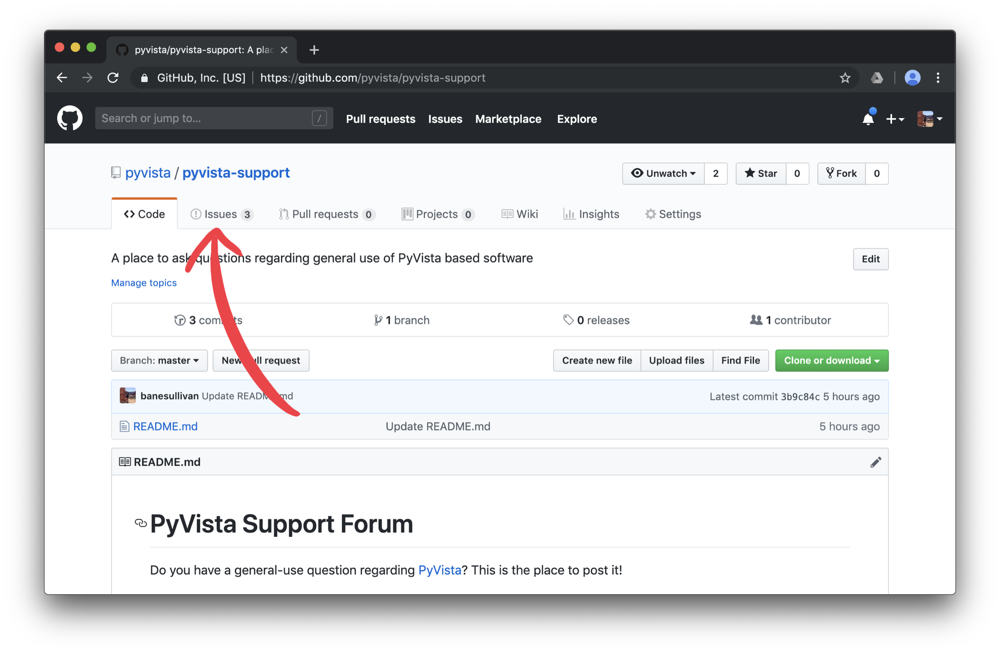

# PyVista Support Forum

Do you have a general-use question regarding [PyVista](https://github.com/pyvista/pyvista)?
This is the place to post it!

[***Create a new issue by following this link***](https://github.com/pyvista/pyvista-support/issues/new)

Please open a new issue in this repository with an informative title and
encompassing description about what you'd like to do with PyVista.
We ❤️ code so please be sure to add the code you currently have - this will
help us address your question and use naming/syntax that is familiar to you.
We also much appreciate sample data files for the task your trying to
complete so, please try to compress your data into a `.zip` archive and attach
the archive to the issue. Don't have sample data? That's okay, just be sure
to give us a detailed description of the type of data you might use.

## Creating a New Issue

1. Navigate to the [issues section](https://github.com/pyvista/pyvista-support/issues)
of this repository:

2. [Create a new issue](https://github.com/pyvista/pyvista-support/issues/new):

3. Fill out the issue template with your question by giving an informative
title and descriptive body, perhaps with example code that you have tried:

