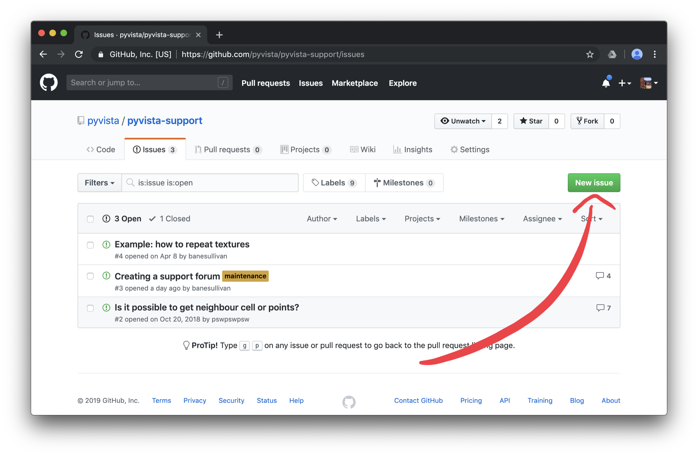

# PyVista Support Forum

Do you have a general-use question regarding [PyVista](https://github.com/pyvista/pyvista)
or projects in the PyVista ecosystem like:

- [`omfvista`](https://github.com/OpenGeoVis/omfvista)
- [`pymeshfix`](https://github.com/akaszynski/pymeshfix)
- [`pyansys`](https://github.com/akaszynski/pyansys)
- [`PVGeo`](https://github.com/OpenGeoVis/PVGeo)
- [`tetgen`](https://github.com/pyvista/tetgen)
- [`pymeshfix`](https://github.com/pyvista/pymeshfix)

This is the place to ask!

To ask a question, please [***create a new issue by following this link***](https://github.com/pyvista/pyvista-support/issues/new)

What should your question include?:

- Open a new issue in this repository with an informative title and
encompassing description about what you'd like to do with PyVista.

- We ❤️ code so please be sure to add the code you currently have - this will
help us address your question and use naming/syntax that is familiar to you.

- We also much appreciate sample data files for the task you are trying to
complete so, please try to compress your data into a `.zip` archive and attach
that archive to the issue. Don't have sample data? That's okay, just be sure
to give us a detailed description of the type of data you might use.

## Creating a New Issue

1. Navigate to the [issues section](https://github.com/pyvista/pyvista-support/issues)
of this repository:

2. Check if there is an issue similar to your question - it's quite possible that others have the same question as you so be sure to explore [all archived and active issues](https://github.com/pyvista/pyvista-support/issues?utf8=✓&q=is%3Aissue).

3. [Create a new issue](https://github.com/pyvista/pyvista-support/issues/new) if you think this question hasn't been asked before now:

4. Fill out the issue template with your question by giving an informative
title and descriptive body, perhaps with example code that you have tried:

